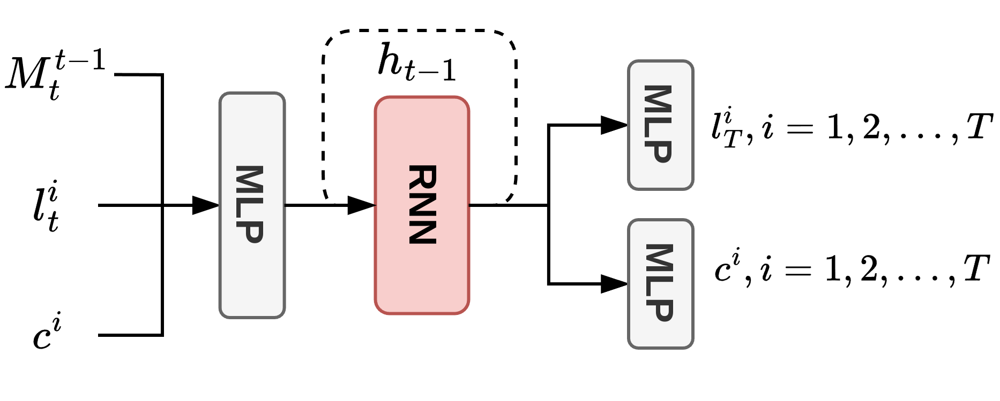
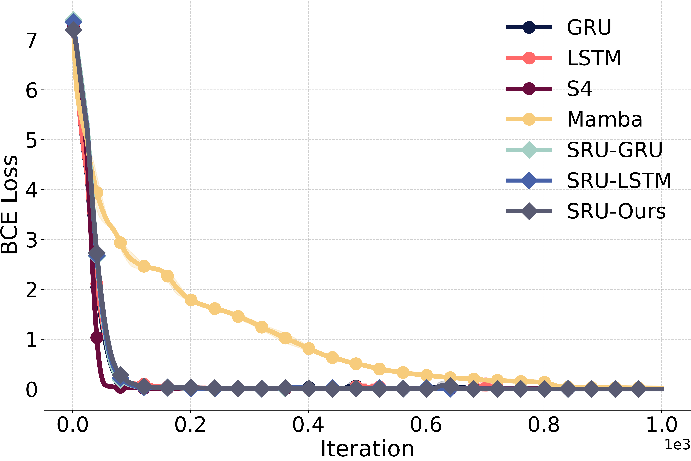
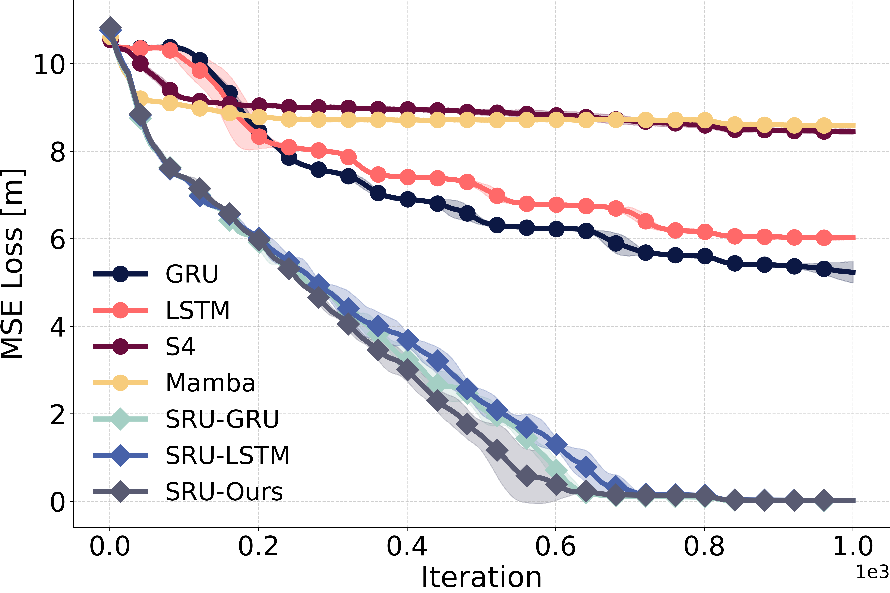
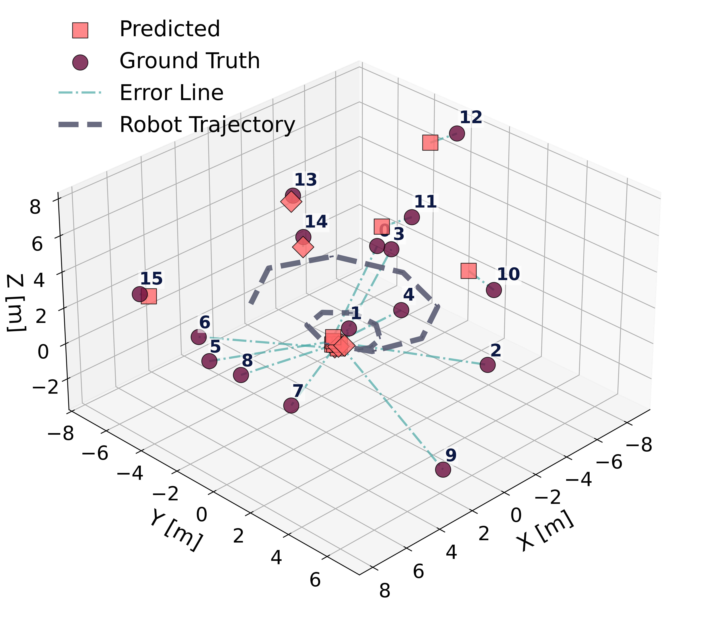
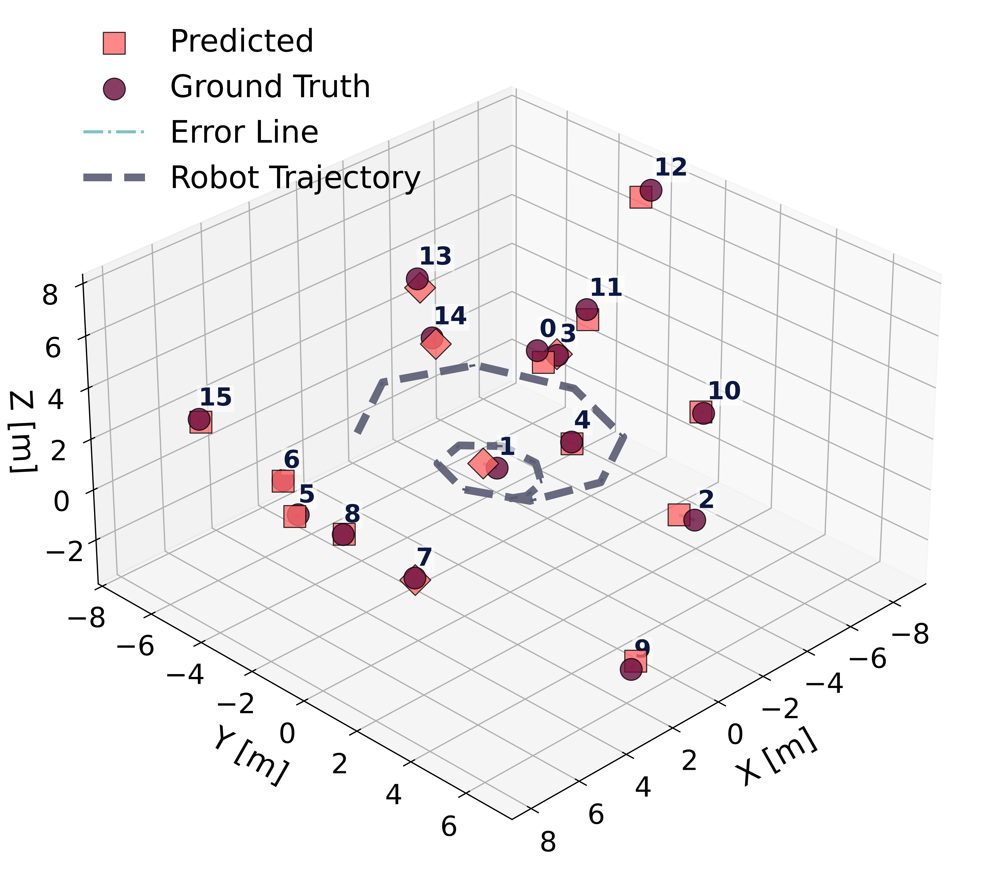

# Spatially-Enhanced Recurrent Units (SRU) - PyTorch Implementation

[](https://journals.sagepub.com/home/ijr)
[](https://michaelfyang.github.io/sru-project-website/)

> **📌 Important Note**: This repository contains the code for **Appendix A: Training details for spatial-temporal memorization task** from the paper "[Spatially-enhanced recurrent memory for long-range mapless navigation via end-to-end reinforcement learning](https://michaelfyang.github.io/sru-project-website/)" (IJRR 2025). This is the **`sru-pytorch-spatial-learning`** repository referenced on the [project website](https://michaelfyang.github.io/sru-project-website/).

## About This Repository

This repository provides the **core PyTorch implementation of Spatially-Enhanced Recurrent Units (SRU)** and the **experimental validation code** for evaluating spatial-temporal memorization capabilities. The controlled experiments in Appendix A demonstrate SRU's superior spatial memory performance compared to standard recurrent architectures (LSTM, GRU) and state-space models (Mamba-SSM, S4).

**Scope of this repository:**
- ✅ Core SRU architecture implementations (SRU-LSTM, SRU-GRU)
- ✅ Spatial-temporal memorization experiments (Appendix A)
- ✅ Baseline comparisons with LSTM, GRU, Mamba-SSM, and S4
- ✅ Training and evaluation scripts for controlled memorization tasks

**Not included in this repository:**
- ❌ Complete end-to-end navigation system (see main paper)
- ❌ Full perception pipeline and real-world deployment code
- ❌ Large-scale reinforcement learning navigation experiments

For the **complete navigation system** and **real-world deployment**, please refer to the related repositories on the [project website](https://michaelfyang.github.io/sru-project-website/).

## The Spatial Memory Challenge

**The Problem**: While standard RNNs (LSTM, GRU) excel at capturing **temporal dependencies**, our research reveals a critical limitation: **they struggle to effectively perform spatial memorization**—the ability to transform and integrate sequential observations from varying perspectives into coherent spatial representations.

**Think of it like this:**
- **Temporal Memorization** (RNNs excel): Remembering the sequence "A → B → C" happened in that order
- **Spatial Memorization** (RNNs struggle): Transforming "I saw landmark A from position 1, then from position 2" into understanding where landmark A actually is in space

Classical approaches achieve spatial registration through homogeneous transformations, but **standard RNNs struggle to learn these spatial transformations implicitly**, even when provided with ego-motion information.

## SRU Architecture

**The Solution**: SRUs enhance standard LSTM/GRU with a simple **spatial transformation gate** using element-wise multiplication. The key innovation is the `st ⊙ (...)` operation, which enables the network to implicitly learn spatial transformations from ego-centric observations.

### Network Architecture Overview

<div align="center">
  
  <br>
  <p><strong>Figure:</strong> Overall Training Pipeline and Network Structure</p>
  <p><em>The network processes ego-motion transformations ($M_t^{t-1}$), landmark coordinates ($l_t^i$), and categorical labels ($c^i$) through MLP and RNN layers. The RNN (shown in red) is the focus of enhancement with spatial transformation gates. The network outputs predicted landmark coordinates ($l_T^i$) and categorical labels ($c^i$) through MLPs.</em></p>
</div>

### Implemented Models

- **SRU-LSTM**: LSTM with Additive Spatial Transformation Gates
- **SRU-GRU**: GRU with Additive Spatial Transformation Gates
- **SRU-LSTM-Gated**: LSTM with Additive Transformation and Gated Refinement
- **Baselines**: Standard LSTM, GRU, Mamba-SSM, and S4 (simplified implementation)

<details>
<summary><b>Click to see technical details</b></summary>

### SRU-LSTM
```python
st = Wxs·xt + bs                                    # Spatial transformation term
gt = tanh(st ⊙ (Wxg·xt + Whg·ht-1 + bg))          # Modified candidate gate
ct = ft ⊙ ct-1 + it ⊙ gt                          # Cell state update
ht = ot ⊙ tanh(ct)                                 # Hidden state output
```

### SRU-GRU
```python
st = Wxs·xt + bs                                    # Spatial transformation term
h̃t = tanh(st ⊙ (Wxh·xt + Whh·(rt⊙ht-1) + bh))    # Modified candidate hidden
ht = (1-zt) ⊙ h̃t + zt ⊙ ht-1                      # Hidden state update
```
</details>

## Repository Structure

```
sru-pytorch-spatial-learning/
├── network/                    # SRU and baseline implementations
│   ├── __init__.py
│   ├── lstm_sru.py            # LSTM_SRU implementation
│   ├── gru_sru.py             # GRU_SRU implementation
│   ├── vanilla_mamab.py       # MambaNet implementation (optional)
│   └── s4_utils/              # S4 utilities (simplified implementation)
├── setup.py                    # Package setup configuration
├── pyproject.toml             # Modern Python packaging
├── SETUP_GUIDE.md             # Installation and setup guide
├── IMPORT_EXAMPLES.md         # Detailed usage examples
├── QUICK_REFERENCE.md         # Quick lookup table
├── example_usage.py           # Runnable example demonstrating all networks
├── run_pointcloud.py          # Training/evaluation script
├── visualize_pointobs.py      # 3D visualization tool
├── dataloader/                # Dataset loaders
├── utils/                     # Helper functions
├── params/pointcloud.yaml     # Configuration file
├── data/cloud/                # Dataset storage
├── models/cloud/              # Model checkpoints
└── figures/cloud/             # Visualizations
```

## Installation

**Requirements**: Python 3.8+, PyTorch 2.0+, CUDA 11.8+ (for GPU)

```bash
# Create environment
conda create -n sru python=3.10 -y
conda activate sru

# Install PyTorch with CUDA support
pip install torch torchvision --index-url https://download.pytorch.org/whl/cu124

# Install dependencies
pip install pypose mamba-ssm causal-conv1d matplotlib scipy scikit-learn wandb pyyaml
```

**Note**: Adjust `cu124` to match your CUDA version. To use MambaNet, install mamba-ssm: `pip install mamba-ssm`. For troubleshooting, see the [detailed installation guide](https://github.com/state-spaces/mamba#installation).

### Development Installation (for using/modifying the SRU networks)

```bash
# From the repository root
pip install -e .
```

## Quick Start - Using the Networks

The package provides three SRU network implementations:

```python
import torch
from network import LSTM_SRU, LSTM_SRU_Gate, GRU_SRU

# Create models
lstm_sru = LSTM_SRU(input_size=15, hidden_size=128, num_layers=2, batch_first=True)
lstm_sru_gate = LSTM_SRU_Gate(input_size=15, hidden_size=128, num_layers=2, batch_first=True)
gru_sru = GRU_SRU(input_size=15, hidden_size=128, num_layers=2, batch_first=True)

# Forward pass
x = torch.randn(4, 10, 15)  # (batch_size, seq_len, input_size)
output, state = lstm_sru(x)  # output: (4, 10, 128)
```

**Available SRU Networks:**
- **LSTM_SRU**: LSTM with Additive Spatial Transformation Gates
- **LSTM_SRU_Gate**: LSTM with Additive Transformation and Gated Refinement
- **GRU_SRU**: GRU with Additive Spatial Transformation Gates

> **Note**: MambaNet and S4 are included in the repository as baseline implementations for experimental comparisons, but are not part of the pip-installable package.

For detailed usage examples and patterns, see **[IMPORT_EXAMPLES.md](IMPORT_EXAMPLES.md)**.

## Usage

### Training

Train models on the point cloud prediction task:

```bash
# Train with default settings
python run_pointcloud.py --train

# Train with Weights & Biases logging
python run_pointcloud.py --train --wandb
```

### Evaluation

Evaluate trained models:

```bash
python run_pointcloud.py
```

This will load the most recent checkpoint and visualize predictions.

### Configuration

Edit `params/pointcloud.yaml` to modify:
- Model architecture (hidden size, num layers)
- Training hyperparameters (learning rate, batch size, epochs)
- Dataset parameters (sequence length, rotation scale)
- Optimizer settings

## Experimental Tasks

This repository implements the spatial-temporal memorization experiments described in our paper:

### Spatial-Temporal Memory Task

At each timestep `t`, the agent receives:
- Landmark coordinates `l_t^i ∈ ℝ³` in the robot's current frame
- Binary categorical labels `c^i` associated with each landmark
- Ego-motion transformation matrix `M_{t-1→t}` from previous to current frame

After `T` timesteps, the network must:
1. **Spatial Task**: Transform and memorize all observed landmark coordinates into the final frame at `t=T`
2. **Temporal Task**: Recall all binary labels in sequential order

### Baseline Comparisons

We compare SRU units against:
- **Standard RNNs**: LSTM, GRU
- **State-Space Models**: Mamba-SSM, S4

## Experimental Results

### Key Findings

| Metric | Standard RNNs | SRU Units |
|--------|--------------|-----------|
| **Temporal Memorization** | ✅ Converge quickly | ✅ Converge quickly |
| **Spatial Memorization** | ❌ Struggle to learn | ✅ Learn effectively |

### Training Loss

The temporal task requires models to recall binary labels in sequential order, while the spatial task requires models to transform and memorize landmark coordinates. Below are the results showing SRU's superior spatial memorization capabilities:

<div align="center">
  <table>
    <tr>
      <td align="center" width="50%">
        
        <br>
        <strong>Figure 1a:</strong> Temporal Task Loss
        <br>
        <em>SRU and baseline RNNs show comparable convergence speed on sequential memorization.</em>
      </td>
      <td align="center" width="50%">
        
        <br>
        <strong>Figure 1b:</strong> Spatial Task Loss
        <br>
        <em>SRU achieves lower loss and faster convergence compared to LSTM, GRU, and state-space models.</em>
      </td>
    </tr>
  </table>
</div>

### Spatial Coordinate Mapping

Qualitative comparison of spatial coordinate predictions from LSTM and SRU models:

<div align="center">
  <table>
    <tr>
      <td align="center" width="50%">
        
        <br>
        <strong>Figure 2a:</strong> LSTM Spatial Mapping
        <br>
        <em>Standard LSTM fails to accurately transform and register landmark coordinates across time steps.</em>
      </td>
      <td align="center" width="50%">
        
        <br>
        <strong>Figure 2b:</strong> SRU Spatial Mapping
        <br>
        <em>SRU effectively registers landmark positions, demonstrating superior spatial transformation capabilities.</em>
      </td>
    </tr>
  </table>
</div>

## Citation

If you use this code in your research, please cite:

```bibtex
@article{yang2025sru,
  author = {Yang, Fan and Frivik, Per and Hoeller, David and Wang, Chen and Cadena, Cesar and Hutter, Marco},
  title = {Spatially-enhanced recurrent memory for long-range mapless navigation via end-to-end reinforcement learning},
  journal = {The International Journal of Robotics Research},
  year = {2025},
  doi = {10.1177/02783649251401926},
  url = {https://doi.org/10.1177/02783649251401926}
}
```

## Contact

For questions or issues, please contact:
- **Fan Yang** - fanyang1@ethz.ch

## License

MIT License

Copyright (c) 2024-2025 Fan Yang, Robotic Systems Lab, ETH Zurich

Permission is hereby granted, free of charge, to any person obtaining a copy
of this software and associated documentation files (the "Software"), to deal
in the Software without restriction, including without limitation the rights
to use, copy, modify, merge, publish, distribute, sublicense, and/or sell
copies of the Software, and to permit persons to whom the Software is
furnished to do so, subject to the following conditions:

The above copyright notice and this permission notice shall be included in all
copies or substantial portions of the Software.

THE SOFTWARE IS PROVIDED "AS IS", WITHOUT WARRANTY OF ANY KIND, EXPRESS OR
IMPLIED, INCLUDING BUT NOT LIMITED TO THE WARRANTIES OF MERCHANTABILITY,
FITNESS FOR A PARTICULAR PURPOSE AND NONINFRINGEMENT. IN NO EVENT SHALL THE
AUTHORS OR COPYRIGHT HOLDERS BE LIABLE FOR ANY CLAIM, DAMAGES OR OTHER
LIABILITY, WHETHER IN AN ACTION OF CONTRACT, TORT OR OTHERWISE, ARISING FROM,
OUT OF OR IN CONNECTION WITH THE SOFTWARE OR THE USE OR OTHER DEALINGS IN THE
SOFTWARE.

## Acknowledgments

This project builds upon:
- [Mamba: Linear-Time Sequence Modeling with Selective State Spaces](https://github.com/state-spaces/mamba)
- [Structured State Space Models (S4)](https://github.com/state-spaces/s4)
- PyTorch and the broader deep learning community
